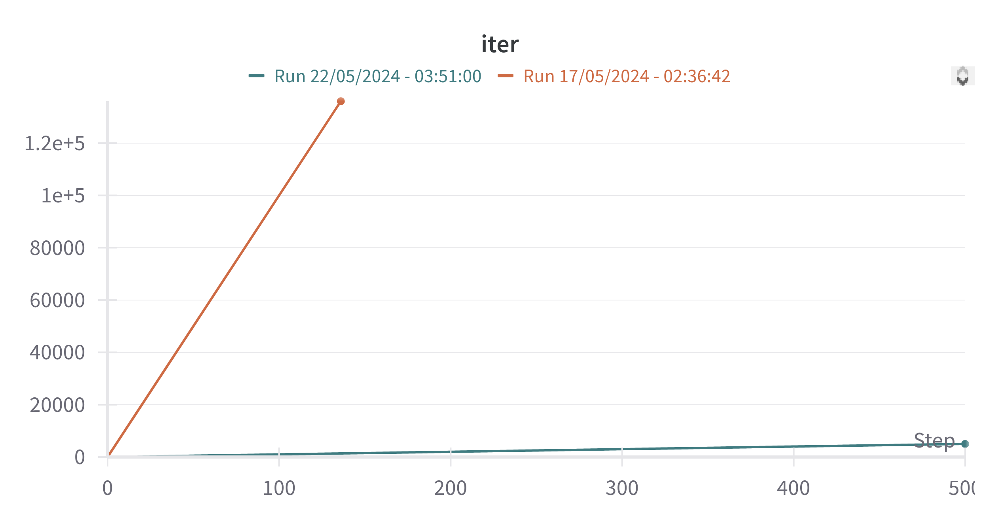
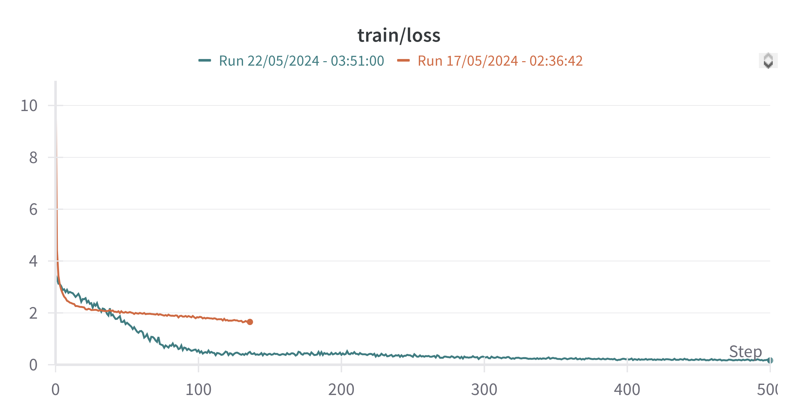
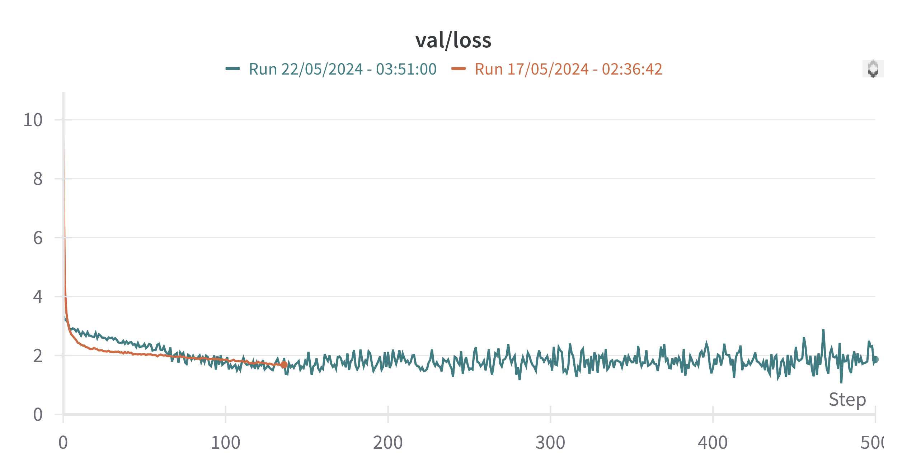

Training an SLM

This experiment is an adaptation of Andrej Karpathy's nanoGPT to train a small language model. Despite its small size, this model can generate relatively coherent text but struggles with instruction-following and accurate information retrieval. Typically, models with over a billion parameters are needed for consistently usable responses.

Datasets were sourced from Hugging Face. The model architecture consists of 123.59 million parameters, 12 layers with 12 heads per layer, and an embedding dimension of 768 across a vocabulary of 50304 tokens. Bias was not used and initial training had a dropout rate of 0.0, which was adjusted to 1.0 during fine-tuning. The dataset mix included various sets from Open-Orca, Databricks Dolly 15 and others[^1].

## Training results

#### Initial vs Favorite Model Output

<br><br>
#### Red is base training and blue is finetuning




## Installation

### Prerequisites

- Download the datasets mentioned in the `create_first_training_data.py` script and place them in `Data/Datasets`.
- Install all required libraries via pip. Ensure you have access tokens to `huggingface-cli` and `wandb`.

### Steps

1. Clone the repository.
    ```sh
    git clone https://github.com/DanielSarf/Training-an-SLM.git
    ```

2. Install the necessary dependencies.
    ```sh
    pip install -r requirements.txt
    ```

## Usage

To train and use the model, execute the following steps:

### Prepare your training data

```sh
python create_first_training_data.py
```

This script will create tokenized training and validation data from various datasets like OpenOrca, WizardLM, etc.

### Train the model

```sh
python train.py
```

### Fine-tune the model

```sh
python finetune.py
```

### Run and evaluate the model

```sh
python run.py
```

### Example

```plaintext
<|user|>:
Hello, how are you?
<|assistant|>:
I am an AI model here to assist you!<|endoftext|>
```

### Note

Ensure you input the correct model import paths in `finetune.py` and `run.py`.

## Scripts

- **create_first_training_data.py**: Responsible for creating the initial training and validation data by combining multiple datasets and tokenizing them.
- **train.py**: Performs the training loop with evaluation, learning rate decay, and logging. Responsible for saving checkpoints and managing model state during training.
- **finetune.py**: Continues training a pre-trained model with additional datasets, improving its performance on specific tasks or datasets.
- **run.py**: Loads the trained model allowing for interactive querying to evaluate model performance.

## Contribute

We welcome contributions!

Feel free to fork the repository and send in your pull requests!

## Model Architecture and Training

The architecture of the model comprises 12 layers with 12 attention heads per layer, resulting in approximately 123.59 million parameters. The embedding dimension is set to 768, spread across a vocabulary of 50304 tokens. Initial training parameters excluded biases, with a dropout rate of 0.0. During fine-tuning, dropout was set to 0.1 to improve generalization and model robustness.

### Dataset and Training Procedure

#### Initial Training

Initially the model was trained on a context size of 512 tokens at a batch size of 12 and did 136,000 iterations. Datasets were Open-Orca, Databricks Dolly 15K, WizardLM-Orca and Open-Platypus. This is a total of ~1.4 billion tokens.

#### Fine-Tuning

After preliminary training, fine-tuning was performed, adjusting the dropout rate and other hyperparameters to refine model performance on specific tasks or datasets. The finetuning data came from oasst1 and oasst2.

### Results and Performance

While the trained model can generate coherent text to some extent, its performance on following instructions and retrieving accurate information is limited. This aligns with known challenges in training smaller language models, which typically require over a billion parameters to consistently yield usable responses.

The overall aim was to test the limits of a relatively small language model and observe the trade-offs in capability versus the model's size.

## Acknowledgements

Special thanks to Andrej Karpathy for nanoGPT, which served as the basis for this project, and to the various dataset providers on Hugging Face who made this research possible.

For any further inquiries or detailed descriptions of script functionalities, please refer to the provided documentation or reach out to me.

[^1]: Refer to the dataset sources for detailed information. You can find commented out linked to them in 'create_first_training_data.py'.
